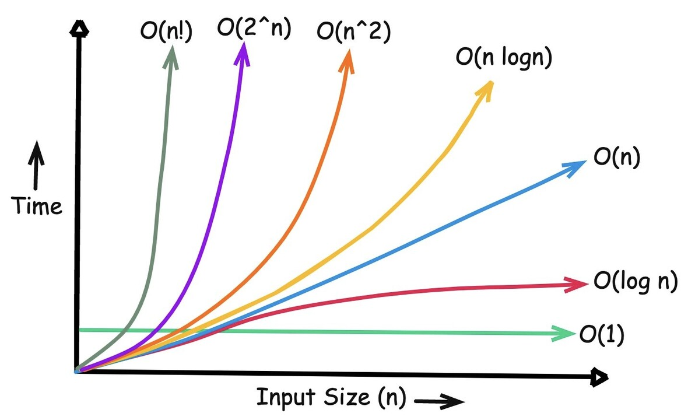

# Complexidade de algoritmos

Notação Big O descreve como o uso de recursos de um algoritmo cresce em função
do tamanho da entrada. Ela não mede diretamente o tempo real em segundos.

- **Complexidade temporal** descreve o crescimento do número de operações.
- **Complexidade espacial** descreve o crescimento do uso adicional de memória.

Hardware, linguagem, implementação e características dos dados também afetam o
desempenho observado. Big O ajuda a comparar a capacidade de escala dos
algoritmos, especialmente para entradas grandes.

## Complexidades comuns

| Notação | Nome | Exemplo |
|---|---|---|
| `O(1)` | Constante | Acessar uma posição conhecida de um array |
| `O(log n)` | Logarítmica | Busca binária em dados ordenados |
| `O(n)` | Linear | Percorrer todos os elementos |
| `O(n log n)` | Linear-logarítmica | Merge sort |
| `O(n²)` | Quadrática | Comparar todos os pares com dois laços |
| `O(2ⁿ)` | Exponencial | Explorar subconjuntos por força bruta |
| `O(n!)` | Fatorial | Testar todas as permutações |

Big O normalmente expressa um limite assintótico superior. Em uma análise mais
completa, também se distinguem melhor caso, caso médio e pior caso.

## Tempo e memória

Uma solução pode trocar tempo por memória ou memória por tempo. Um cache, por
exemplo, consome espaço para evitar cálculos repetidos. A escolha depende dos
limites e requisitos do problema.

Veja os [exemplos de complexidade em JavaScript](./exemplos.js).
