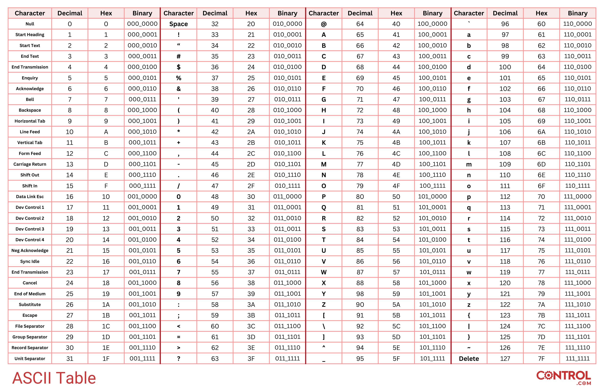

# Representação de dados

## Bits e bytes

O sistema binário usa a base 2 e representa valores com os dígitos `0` e `1`.
Um **bit**, abreviação de *binary digit*, é a menor unidade de informação
digital.

Um **byte** reúne oito bits. Como cada bit admite dois estados, um byte pode
representar 256 combinações (`2⁸`), numeradas de 0 a 255.

Para converter um número binário em decimal, multiplique cada dígito pela
potência de 2 correspondente à sua posição e some os resultados. Por exemplo:

```text
1011₂ = 1 × 2³ + 0 × 2² + 1 × 2¹ + 1 × 2⁰ = 11₁₀
```

Para converter um inteiro decimal positivo em binário, divida-o repetidamente
por 2, registre os restos e leia-os da última divisão para a primeira.

## ASCII

ASCII é um padrão de codificação que associa números a caracteres. A tabela
abaixo apresenta os 128 valores do ASCII original em decimal, hexadecimal e
binário.



ASCII não representa todos os idiomas e símbolos modernos. Aplicações atuais
normalmente usam Unicode, frequentemente com a codificação UTF-8.

## Memória

Durante a execução, variáveis, arrays, objetos e outras estruturas ocupam
espaço na memória RAM. Alocar memória significa reservar esse espaço; usá-la
significa armazenar dados nele.

JavaScript possui coleta de lixo (*garbage collection*). O mecanismo recupera
automaticamente a memória de objetos que não podem mais ser alcançados pelo
programa. Isso reduz o gerenciamento manual, mas não impede todo tipo de
vazamento de memória: referências mantidas sem necessidade continuam ocupando
espaço.

## Linguagens de alto e baixo nível

Linguagens de baixo nível expõem detalhes próximos do hardware. Linguagens de
alto nível oferecem abstrações mais próximas da forma como pessoas descrevem
problemas. Essa classificação é relativa: uma linguagem pode ser considerada
mais alta ou mais baixa quando comparada a outra.
